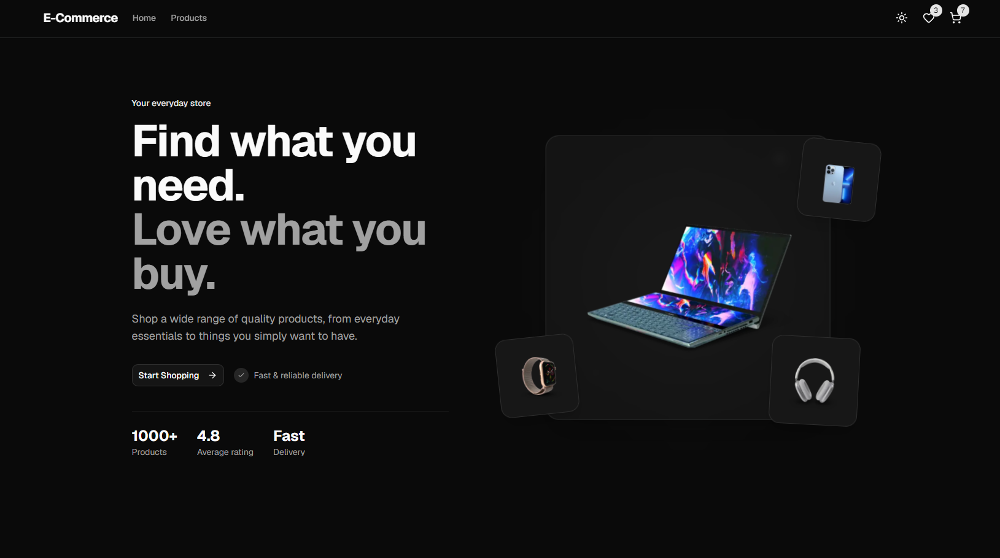

# 🛒 E-Commerce Store

A modern and responsive e-commerce frontend built with **Next.js, TypeScript, Tailwind CSS, shadcn/ui, TanStack React Query, and Zustand**.

This project was built as a frontend portfolio project with a focus on reusable components, client-side state management, data fetching, responsive UI, and a clean project structure.

## ✨ Preview



## 🚀 Features

- 🏠 Modern responsive homepage
- 🛍️ Product listing and product details
- 🔎 Product search
- 🎯 Product filtering
- ↕️ Product sorting
- 📄 Pagination
- 🛒 Shopping cart
- ➕ Increase/decrease cart quantity
- 📦 Stock-aware cart quantity
- ❤️ Favorites / wishlist
- 💾 Persistent cart and favorites using localStorage
- 🌙 Dark / light theme
- 📱 Responsive design
- ⏳ Loading states and skeleton UI
- 🧩 Reusable UI components
- 🔄 Server state management with TanStack React Query
- 🗃️ Client state management with Zustand

## 🧰 Tech Stack

### Frontend

- [Next.js](https://nextjs.org/)
- [React](https://react.dev/)
- [TypeScript](https://www.typescriptlang.org/)
- [Tailwind CSS](https://tailwindcss.com/)
- [shadcn/ui](https://ui.shadcn.com/)
- [Lucide React](https://lucide.dev/)

### State & Data

- [TanStack React Query](https://tanstack.com/query)
- [Zustand](https://zustand.docs.pmnd.rs/)
- Axios

### Forms & Validation

- React Hook Form
- Zod

### API

- [DummyJSON](https://dummyjson.com/)

## 📁 Project Structure

```text
ecommerce-front/
├── app/              # Next.js App Router pages and layouts
├── components/       # Reusable UI and feature components
├── hooks/            # Custom React hooks
├── lib/              # Utilities and shared configuration
├── providers/        # Application providers
├── services/         # API and data-access logic
├── stores/            # Zustand stores
├── types/             # TypeScript types
└── public/            # Static assets and screenshots
```

## 🛒 Cart Management

The cart is managed with Zustand and persisted in the browser using localStorage.

Cart quantities are also limited by the product stock, preventing users from adding more items than are currently available.

The product stock itself is not modified when an item is added to the cart. Stock changes are intended to happen during the checkout/order process once a backend is introduced.

## ❤️ Favorites

Favorites are managed through a dedicated Zustand store and persisted in localStorage, allowing users to keep their wishlist after refreshing or reopening the application.

## 🔄 Data Fetching

Product data is fetched from DummyJSON and managed with TanStack React Query.

React Query is responsible for:

- Server state management
- Request caching
- Loading states
- Error states
- Query invalidation and refetching

## 🎨 UI

The interface is built with Tailwind CSS and shadcn/ui components.

The application also supports light and dark themes using `next-themes`.

## ⚙️ Getting Started

### 1. Clone the repository

```bash
git clone https://github.com/ali-tz-2004/ecommerce-front.git
cd ecommerce-front
```

### 2. Install dependencies

```bash
npm install
```

### 3. Start the development server

```bash
npm run dev
```

Open:

```text
http://localhost:3000
```

## 🏗️ Production Build

To create a production build:

```bash
npm run build
```

Then start the production server:

```bash
npm run start
```

## 🔮 Future Development

This project is currently focused on the frontend.

The next stage of the project is to build a custom backend using **ASP.NET Core / .NET**, replacing the mock API with a real backend and database.

Planned backend features include:

- User authentication
- Product management
- Categories
- Cart and orders
- Inventory management
- Checkout
- Order history
- Database persistence
- RESTful APIs

The frontend will then be connected to the custom .NET backend to evolve the project into a full-stack e-commerce application.

## 📌 Project Status

**Current:** Frontend version

**Planned:** Full-stack version with ASP.NET Core / .NET backend

## 👨‍💻 Author

**Ali Taghizadeh**

Frontend Developer focused on React, Next.js, TypeScript, and modern web development.
